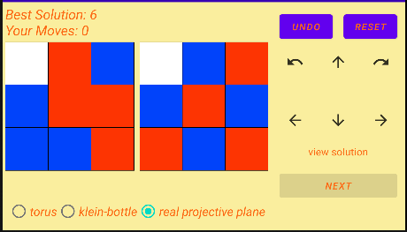
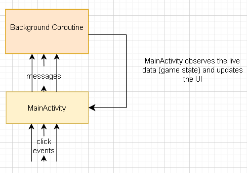

# RPuzzle
Android puzzle app inspired by Rubik Electronic game, extended to include other topological surfaces Torus, Klien-bottle, Real Projective Plane.

The goal is to match the current board pattern to that of the target board in as few moves as possible.

3 diffetent board types are implemented
* Torus
* Klien Bottle
* Real Projective Plane

Adding a layer of complexity from top to bottom

### Architecture

App follows MVVM architecture

MainActivity listens for user click events passes these events as messages to a kotlin channel,
a background coroutine listens on this channel, and is the only one that changes the game state,
MainActivity observes on the game state changes and updates the UI

This App contains just 5 files
* MainActivity.kt
* PlayRPuzzleViewModel.kt (contains the live data) 
* Puzzle.kt (live data)
* RBoardAdvanced.kt (game logic)
* RBoardView.kt (game board ie android canvas)
